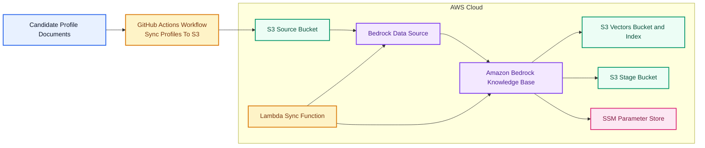

# Talent Knowledge Base

Talent Knowledge Base is an enterprise knowledge repository for candidate profiles. It is designed to support AI-driven talent discovery and semantic search using Amazon Bedrock Knowledge Bases, with infrastructure managed through Terraform in `infra-as-code/`.

## What This Repository Contains

- Candidate profile knowledge assets under `docs/profiles/`
- Infrastructure as code for S3 storage, Bedrock Knowledge Base, and sync automation under `infra-as-code/`
- Environment-specific Terraform variables under `infra-as-code/tf-vars/`

## Architecture

The current infrastructure provisions:

- An S3 source bucket for candidate profile documents
- An S3 stage bucket for supplemental ingestion artifacts
- An S3 Vectors bucket and index for vector storage
- An Amazon Bedrock Knowledge Base and S3-backed data source
- A sync Lambda module to trigger or manage knowledge base ingestion updates
- A GitHub Actions workflow to publish candidate profile documents to the S3 source bucket

The profile sync path is automated through the GitHub Actions workflow in `.github/workflows/sync-profiles-to-s3.yml`, which uploads documents from `docs/profiles/` into the S3 source bucket before Bedrock ingestion is triggered.

## Infra Reference

The diagram above is based on the Terraform configuration in `infra-as-code/tf-talent-kb/`, especially:

- `s3.tf`
- `bedrock-kb.tf`
- `bedrock-kb-sync.tf`

## Purpose

This repository provides the foundation for storing, indexing, and retrieving candidate knowledge in a format suitable for semantic search and downstream AI applications.
